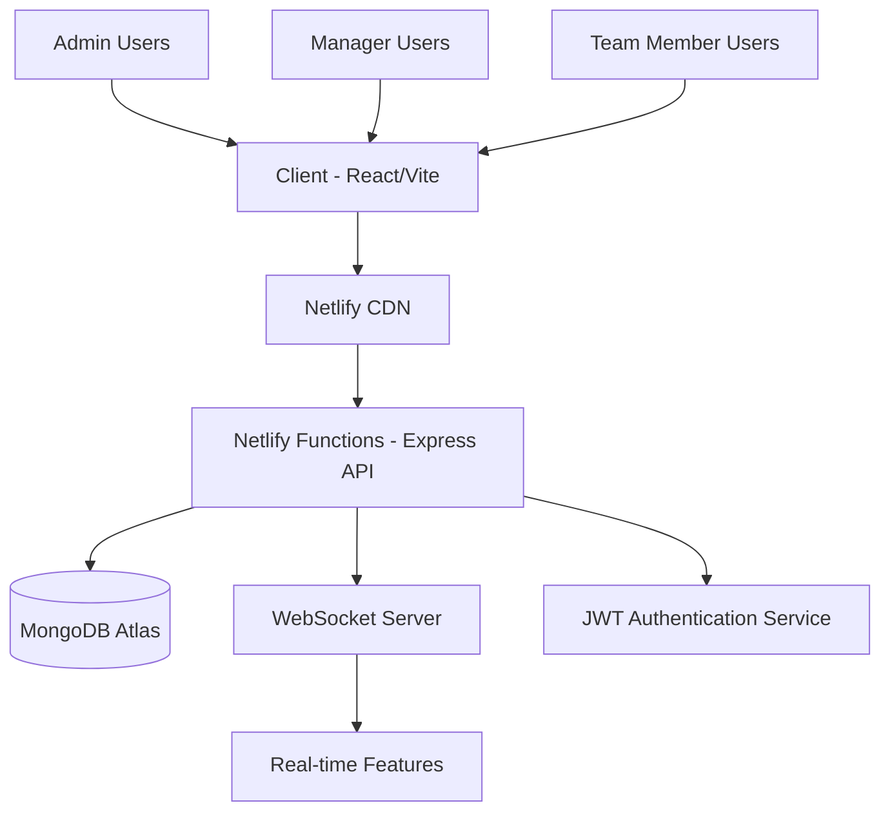

# Sharple - Workforce Management & Productivity App

## 1. Overview

Sharple is a comprehensive workforce management and productivity application designed to serve as a complete business ecosystem for modern organizations. It aims to enhance productivity, improve collaboration, and gamify the work experience while maintaining professional standards and security requirements. The application features role-based authentication, real-time collaboration, and gamified productivity tracking, making it suitable for various organizational needs.

## 2. Architecture

### Frontend Architecture
- **Framework:** React 18 with Vite
- **Styling:** Tailwind CSS with custom design system (glassmorphic and neumorphic elements)
- **State Management:** Zustand with multiple specialized stores
- **UI Components:** shadcn/ui with Lucide React icons
- **Animations:** Framer Motion
- **PWA:** Progressive Web App with responsive mobile-first design

### Backend Architecture
- **Server:** Node.js with Express
- **Database:** MongoDB with Mongoose ODM
- **Authentication:** JWT-based with RBAC
- **Real-Time Features:** WebSocket support
- **Deployment:** Netlify Functions for serverless deployment

### System Architecture Diagram

## 3. User Roles & Permissions

### Admin Role
- System oversight and employee management
- Payroll control and financial analytics
- System configuration and settings
- Department and project oversight
- Advanced reporting and analytics

### Manager Role
- Team oversight and performance monitoring
- Project management and milestone tracking
- Task assignment and approval workflows
- Direct reports management
- Team collaboration tools

### Team Member Role
- Personal task management and tracking
- Time tracking and attendance
- Performance metrics and rewards
- Profile management
- Communication with managers and team

## 4. Authentication & Security

- **Authentication:** JWT-based secure authentication with role-based access control (RBAC)
- **Session Management:** Session management and persistence
- **Password Security:** Password security with reset workflows
- **Role-Based Permissions:** Role-based permissions for all features
- **API Security:** Secure API endpoints with proper validation

## 5. Dashboard System

### Admin Dashboard
- Organization-wide metrics and KPIs
- Financial insights with payroll summaries
- HR analytics including recruitment pipeline
- Employee distribution and performance monitoring
- System health and error tracking

### Manager Dashboard
- Team performance metrics and individual stats
- Task management overview with completion rates
- Project status monitoring and milestone tracking
- Approval queue management
- Team distribution and workload balancing

### Team Member Dashboard
- Personal tasks with completion tracking
- Individual performance metrics and KPIs
- Rewards wallet with points and achievements
- Time tracking and attendance summary
- Roadmap view with personal responsibilities

## 6. Core Features

### Task Management System
- Intelligent task creation and assignment
- Real-time progress tracking with milestone monitoring
- Quality control with review workflows and approval chains
- Performance metrics with efficiency calculations and TAT tracking
- Task statuses: TODO → IN_PROGRESS → REVIEW → DONE → BLOCKED

### Project Management
- Roadmap creation with stage-based project planning
- Resource allocation and team assignment
- Milestone tracking with progress monitoring
- Client management with customer information
- Project analytics with budget and timeline tracking
- Project statuses: Planning → Active → On Hold → Completed → Cancelled

### Time Management
- **Pomodoro Timer:** Focus sessions with productivity tracking
- **TAT Timer:** Turnaround time monitoring with efficiency metrics
- **Attendance Tracking:** Check-in/out with work hours calculation
- **Leave Management:** Request workflow with approval system
- Real-time session tracking with automatic calculations

### Payroll Management
- Automated salary processing with base pay, bonuses, and deductions
- Tax calculations with compliance features
- Payment history with transaction records and payslips
- Performance-based bonus calculations
- Attendance-based salary adjustments
- Monthly payroll generation and processing

### Gamification & Rewards System
- **Rewards Wallet:** Collectible items (Stars, Butterflies, Trophies, etc.)
- **Achievement System:** Badges for various accomplishments
- **Level System:** Progressive advancement (Beginner → Intermediate → Advanced → Master → Legend)
- **Point System:** Performance-based point calculations
- **Daily/Weekly/Monthly Challenges:** Goal-oriented tasks
- **Leaderboards:** Global and team-based rankings

## 7. Messaging & Communication

### Real-time Chat System
- **Direct Chat:** One-on-one conversations
- **Group Chat:** Team and project-based communications
- **Task Chat:** Task-specific communication channels
- **Project Chat:** Project team discussions
- WebSocket-based real-time messaging
- Typing indicators and online status
- Message status (sent, delivered, read)
- Push notifications for new messages

### File Sharing
- Secure file upload and sharing
- Task and project-specific file attachments
- Role-based file permissions
- File search and organization
- Cloud storage integration

## 8. Analytics & Reporting

### Performance Analytics
- Individual and team productivity metrics
- Time tracking with attendance patterns
- Project analytics with progress and budget tracking
- Custom reports with exportable data
- Visual dashboards with charts and graphs
- Real-time KPI monitoring

### Business Intelligence
- Financial reporting and payroll analytics
- Employee performance trends
- Project success rates and timelines
- Resource utilization metrics
- Cost analysis and budget tracking

## 9. UI/UX Design System

### Design Philosophy
- **Glassmorphic Elements:** Frosted glass cards with backdrop blur
- **Neumorphic Elements:** Soft UI with pillow-like buttons
- **Modern UI:** Clean, minimalist interface with consistent spacing
- **Responsive Design:** Mobile-first approach with fluid layouts
- **Accessibility:** WCAG 2.1 AA compliance with keyboard navigation

### Color System
- Semantic color tokens for different states
- Dark/light mode support
- Consistent brand colors throughout
- Status-based color coding (success, warning, error, info)

### Component Library
- Reusable UI components with consistent styling
- Card-based layouts with proper shadows and borders
- Interactive elements with hover and focus states
- Loading states and error handling
- Toast notifications and modal dialogs

## 10. Mobile & PWA Features

- Progressive Web App (PWA) with offline capabilities
- Mobile-optimized interface with touch-friendly controls
- Push notifications for important updates
- Responsive design that works on all screen sizes
- Fast loading with optimized assets

## 11. Integration Features

### Cross-Feature Integration
- Task completion triggers reward points
- Attendance affects payroll calculations
- Project milestones unlock team achievements
- Chat integration with tasks and projects
- Real-time updates across all features

### Data Synchronization
- Real-time data updates across all components
- Optimistic UI updates for better user experience
- Conflict resolution for concurrent edits
- Offline support with sync when online

## 12. Deployment & Infrastructure

- Netlify deployment with serverless functions
- MongoDB Atlas for database hosting
- CDN for static assets
- Environment-based configuration
- Automated testing and CI/CD pipeline
- Performance monitoring and error tracking

## 13. Data Models

### User Model
- Personal information and contact details
- Role and permissions
- Department and team assignments
- Performance metrics and achievements
- Attendance and time tracking data

### Task Model
- Title, description, and priority
- Assignee and manager information
- Status and progress tracking
- Due dates and milestones
- Related files and comments

### Project Model
- Project details and client information
- Team assignments and roles
- Timeline and milestones
- Budget and resource allocation
- Status and progress tracking

### Payroll Model
- Employee salary information
- Attendance records
- Performance bonuses
- Tax calculations
- Payment history

## 14. Key User Flows

### Employee Onboarding
1. Registration and approval workflow
2. Profile creation and team assignment
3. Initial task assignment
4. Training and orientation
5. Performance tracking setup

### Task Execution
1. Task assignment and notification
2. Task acceptance and planning
3. Progress tracking and updates
4. Quality review and approval
5. Completion and reward distribution

### Project Management
1. Project creation and planning
2. Team assignment and resource allocation
3. Milestone tracking and updates
4. Client communication and feedback
5. Project completion and evaluation

### Payroll Processing
1. Attendance data collection
2. Performance metrics calculation
3. Bonus and deduction application
4. Tax calculation and compliance
5. Payslip generation and distribution

## 15. Configuration & Customization

- Configurable company policies and settings
- Customizable dashboard layouts
- Flexible role and permission management
- Customizable reward systems
- Configurable notification preferences
- Multi-language support (extensible)

## 16. Scalability & Performance

- Optimized database queries and indexing
- Efficient state management with Zustand
- Lazy loading and code splitting
- Image optimization and compression
- Caching strategies for better performance
- Real-time updates without performance impact- Profile management
- Communication with managers and team

## 4. Authentication & Security

- **Authentication:** JWT-based secure authentication with role-based access control (RBAC)
- **Session Management:** Session management and persistence
- **Password Security:** Password security with reset workflows
- **Role-Based Permissions:** Role-based permissions for all features
- **API Security:** Secure API endpoints with proper validation

## 5. Dashboard System

### Admin Dashboard
- Organization-wide metrics and KPIs
- Financial insights with payroll summaries
- HR analytics including recruitment pipeline
- Employee distribution and performance monitoring
- System health and error tracking

### Manager Dashboard
- Team performance metrics and individual stats
- Task management overview with completion rates
- Project status monitoring and milestone tracking
- Approval queue management
- Team distribution and workload balancing

### Team Member Dashboard
- Personal tasks with completion tracking
- Individual performance metrics and KPIs
- Rewards wallet with points and achievements
- Time tracking and attendance summary
- Roadmap view with personal responsibilities

## 6. Core Features

### Task Management System
- Intelligent task creation and assignment
- Real-time progress tracking with milestone monitoring
- Quality control with review workflows and approval chains
- Performance metrics with efficiency calculations and TAT tracking
- Task statuses: TODO → IN_PROGRESS → REVIEW → DONE → BLOCKED

### Project Management
- Roadmap creation with stage-based project planning
- Resource allocation and team assignment
- Milestone tracking with progress monitoring
- Client management with customer information
- Project analytics with budget and timeline tracking
- Project statuses: Planning → Active → On Hold → Completed → Cancelled

### Time Management
- **Pomodoro Timer:** Focus sessions with productivity tracking
- **TAT Timer:** Turnaround time monitoring with efficiency metrics
- **Attendance Tracking:** Check-in/out with work hours calculation
- **Leave Management:** Request workflow with approval system
- Real-time session tracking with automatic calculations

### Payroll Management
- Automated salary processing with base pay, bonuses, and deductions
- Tax calculations with compliance features
- Payment history with transaction records and payslips
- Performance-based bonus calculations
- Attendance-based salary adjustments
- Monthly payroll generation and processing

### Gamification & Rewards System
- **Rewards Wallet:** Collectible items (Stars, Butterflies, Trophies, etc.)
- **Achievement System:** Badges for various accomplishments
- **Level System:** Progressive advancement (Beginner → Intermediate → Advanced → Master → Legend)
- **Point System:** Performance-based point calculations
- **Daily/Weekly/Monthly Challenges:** Goal-oriented tasks
- **Leaderboards:** Global and team-based rankings

## 7. Messaging & Communication

### Real-time Chat System
- **Direct Chat:** One-on-one conversations
- **Group Chat:** Team and project-based communications
- **Task Chat:** Task-specific communication channels
- **Project Chat:** Project team discussions
- WebSocket-based real-time messaging
- Typing indicators and online status
- Message status (sent, delivered, read)
- Push notifications for new messages

### File Sharing
- Secure file upload and sharing
- Task and project-specific file attachments
- Role-based file permissions
- File search and organization
- Cloud storage integration

## 8. Analytics & Reporting

### Performance Analytics
- Individual and team productivity metrics
- Time tracking with attendance patterns
- Project analytics with progress and budget tracking
- Custom reports with exportable data
- Visual dashboards with charts and graphs
- Real-time KPI monitoring

### Business Intelligence
- Financial reporting and payroll analytics
- Employee performance trends
- Project success rates and timelines
- Resource utilization metrics
- Cost analysis and budget tracking

## 9. UI/UX Design System

### Design Philosophy
- **Glassmorphic Elements:** Frosted glass cards with backdrop blur
- **Neumorphic Elements:** Soft UI with pillow-like buttons
- **Modern UI:** Clean, minimalist interface with consistent spacing
- **Responsive Design:** Mobile-first approach with fluid layouts
- **Accessibility:** WCAG 2.1 AA compliance with keyboard navigation

### Color System
- Semantic color tokens for different states
- Dark/light mode support
- Consistent brand colors throughout
- Status-based color coding (success, warning, error, info)

### Component Library
- Reusable UI components with consistent styling
- Card-based layouts with proper shadows and borders
- Interactive elements with hover and focus states
- Loading states and error handling
- Toast notifications and modal dialogs

## 10. Mobile & PWA Features

- Progressive Web App (PWA) with offline capabilities
- Mobile-optimized interface with touch-friendly controls
- Push notifications for important updates
- Responsive design that works on all screen sizes
- Fast loading with optimized assets

## 11. Integration Features

### Cross-Feature Integration
- Task completion triggers reward points
- Attendance affects payroll calculations
- Project milestones unlock team achievements
- Chat integration with tasks and projects
- Real-time updates across all features

### Data Synchronization
- Real-time data updates across all components
- Optimistic UI updates for better user experience
- Conflict resolution for concurrent edits
- Offline support with sync when online

## 12. Deployment & Infrastructure

- Netlify deployment with serverless functions
- MongoDB Atlas for database hosting
- CDN for static assets
- Environment-based configuration
- Automated testing and CI/CD pipeline
- Performance monitoring and error tracking

## 13. Data Models

### User Model
- Personal information and contact details
- Role and permissions
- Department and team assignments
- Performance metrics and achievements
- Attendance and time tracking data

### Task Model
- Title, description, and priority
- Assignee and manager information
- Status and progress tracking
- Due dates and milestones
- Related files and comments

### Project Model
- Project details and client information
- Team assignments and roles
- Timeline and milestones
- Budget and resource allocation
- Status and progress tracking

### Payroll Model
- Employee salary information
- Attendance records
- Performance bonuses
- Tax calculations
- Payment history

## 14. Key User Flows

### Employee Onboarding
1. Registration and approval workflow
2. Profile creation and team assignment
3. Initial task assignment
4. Training and orientation
5. Performance tracking setup

### Task Execution
1. Task assignment and notification
2. Task acceptance and planning
3. Progress tracking and updates
4. Quality review and approval
5. Completion and reward distribution

### Project Management
1. Project creation and planning
2. Team assignment and resource allocation
3. Milestone tracking and updates
4. Client communication and feedback
5. Project completion and evaluation

### Payroll Processing
1. Attendance data collection
2. Performance metrics calculation
3. Bonus and deduction application
4. Tax calculation and compliance
5. Payslip generation and distribution

## 15. Configuration & Customization

- Configurable company policies and settings
- Customizable dashboard layouts
- Flexible role and permission management
- Customizable reward systems
- Configurable notification preferences
- Multi-language support (extensible)

## 16. Scalability & Performance

- Optimized database queries and indexing
- Efficient state management with Zustand
- Lazy loading and code splitting
- Image optimization and compression
- Caching strategies for better performance
- Real-time updates without performance impact

